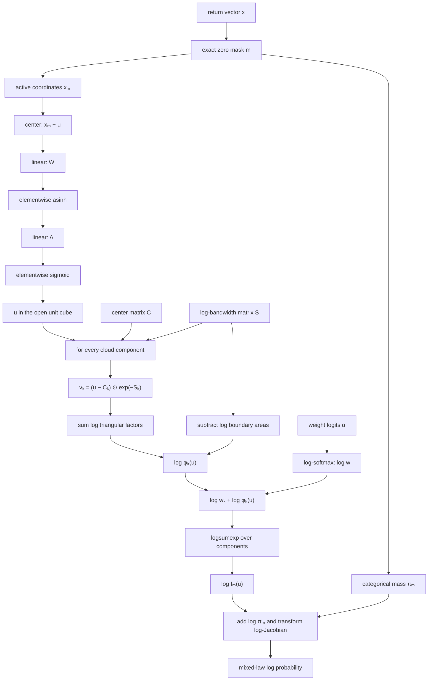

# Consecutive-return distribution model

This document specifies the mixed discrete-continuous model used to represent a
sequence of consecutive BTC log returns. It covers the invertible return-to-cube
mapping, adaptive triangular point cloud, log-space density evaluation,
sampling, fitting and pruning procedure, and the limits of the current fitted
artifacts.

The model is intended to support compact serialization, density evaluation,
sampling, and distribution-derived operations without imposing a Gaussian
shape on the returns.

## 1. Scope and units

For a sequence length `d`, define the return vector

$$
x_t = 10^4
\begin{bmatrix}
\log(P_t/P_{t-1})\\
\log(P_{t+1}/P_t)\\
\vdots\\
\log(P_{t+d-1}/P_{t+d-2})
\end{bmatrix}
\in\mathbb R^d.
$$

The factor $10^4$ expresses every coordinate in basis points. Coordinate zero
is the earliest return. The completed experiments use five years of one-second
BTC closes, with the first four UTC years fitting the representation and the
last UTC year measuring temporal drift.

## 2. The distribution is mixed, not purely continuous

One-second closes often repeat exactly. Consequently, each coordinate has a
point mass at zero and the joint law contains axes, planes, and higher-dimensional
continuous components.

Define the nonzero mask

$$
m_j=\mathbf 1\{x_j\ne0\},
\qquad m\in\{0,1\}^d,
$$

and its probability

$$
\pi_m=P(M=m),
\qquad \sum_m\pi_m=1.
$$

The complete model is

$$
P_X(dx)=
\sum_{m\in\{0,1\}^d}
\pi_m\,
f_m(x_m)\,dx_m\,
\delta_0(dx_{\bar m}),
$$

where $x_m$ contains the active coordinates and $\delta_0$ fixes inactive
coordinates exactly at zero. Therefore the complete law does not have one PDF
with respect to $d$-dimensional Lebesgue measure.

The current artifacts record exact counts from which every $\pi_m$ is derived,
but fit the continuous point cloud only for the all-active mask. The same
construction can be applied to every nonempty mask; those additional
conditional subspace clouds have not yet been fit. The empty mask is a pure
point mass and needs no cloud.

## 3. Global invertible mapping

Each active continuous vector is mapped from unbounded return space to the open
unit cube. In column-vector notation, let

$$
z=W(x-\mu),
\qquad
q=\operatorname{asinh}(z),
\qquad
y=Aq,
\qquad
u=\sigma(y).
$$

Here:

- $\mu\in\mathbb R^d$ is the fitted center in basis points;
- $W=B S_0^{-1/2}$ is the effective whitening matrix;
- $S_0$ is the empirical covariance;
- $B=\exp(G)$, where $G$ is symmetric and trace-free, optionally adjusts
  covariance shape without adding a scale gauge;
- $A\in\mathbb R^{d\times d}$ is an invertible post-asinh transform; and
- $\sigma$ is the coordinatewise logistic sigmoid.

The inverse is exact:

$$
\boxed{
x=\mu+W^{-1}
\sinh\!\left(A^{-1}\operatorname{logit}(u)\right).
}
$$

Thus no finite return is clipped. The tails approach the cube boundary but never
reach it.

### 3.1 Factorization and identifiability

The post-asinh matrix may be represented as

$$
A=RHD,
$$

where $R$ is a proper rotation, $H$ is unit upper triangular and supplies
shear, and $D$ is diagonal with positive entries. Logarithms of the diagonal
entries make positivity automatic.

The matrices before and after `asinh` are not redundant:

$$
A\operatorname{asinh}(W(x-\mu))
\ne
(AW)\operatorname{asinh}(x-\mu)
$$

in general. Linear factors on the same side of a nonlinearity can be combined;
factors separated by `asinh` cannot.

The finalized 2D and 3D fits are close to diagonal after covariance whitening,
but the general representation remains valid for rotation and shear.

### 3.2 Jacobian

For density evaluation in return space,

$$
\begin{aligned}
\log|\det J_T(x)|={}&
\log|\det W|+\log|\det A|\\
&-\frac12\sum_j\log(1+z_j^2)
+\sum_j\left[\log u_j+\log(1-u_j)\right].
\end{aligned}
$$

The sigmoid terms should be evaluated as

$$
\log\sigma'(y)=-\operatorname{softplus}(-y)-\operatorname{softplus}(y)
$$

to remain stable in the tails.

## 4. Adaptive triangular point cloud

Let the all-active mapped density contain $M$ components. Component $k$
has center $C_k\in(0,1)^d$, positive bandwidth vector
$H_k\in\mathbb R_+^d$, and weight $w_k\ge0$, with
$\sum_k w_k=1$.

For one coordinate, define the raw compact triangle

$$
t(u;c,h)=
\left[1-\frac{|u-c|}{h}\right]_+.
$$

Its exact area after truncation to the unit interval is

$$
\begin{aligned}
a(c,h)={}&h
-\frac{[h-c]_+^2}{2h}
-\frac{[h-(1-c)]_+^2}{2h}.
\end{aligned}
$$

The normalized product kernel and mapped density are

$$
\phi_k(u)=
\prod_{j=1}^d
\frac{t(u_j;C_{kj},H_{kj})}{a(C_{kj},H_{kj})},
$$

$$
\boxed{
f_U(u)=\sum_{k=1}^M w_k\phi_k(u).
}
$$

Every component integrates to one over $[0,1]^d$; therefore the mixture is
normalized by construction and is nonnegative everywhere.

One low-mass background component is centered at $(1/2,\ldots,1/2)$ with
bandwidth $(1/2,\ldots,1/2)$. It has full support on the cube interior but
vanishes at its boundary, avoiding artificially heavy decoded return tails.

### 4.1 Affine interpretation

Ignoring boundary truncation for a moment, set

$$
D_k=\operatorname{diag}(H_k),
\qquad
v_k=D_k^{-1}(u-C_k).
$$

With the canonical product tent

$$
\psi(v)=\prod_j[1-|v_j|]_+,
$$

the component is an affine image of the same base kernel:

$$
\phi_k(u)=
\frac{1}{|\det D_k|}
\psi\!\left(D_k^{-1}(u-C_k)\right),
\qquad
|\det D_k|=\prod_j H_{kj}.
$$

Boundary truncation replaces $\prod_j H_{kj}$ with the exact product of
areas $\prod_j a(C_{kj},H_{kj})$.

In homogeneous coordinates, each component transformation is

$$
\begin{bmatrix}u\\1\end{bmatrix}
=
\begin{bmatrix}D_k&C_k\\0&1\end{bmatrix}
\begin{bmatrix}v\\1\end{bmatrix}.
$$

The kernel cloud is consequently stored as two $M\times d$ matrices—centers
and bandwidths—and one length-$M$ weight vector. Centers are translations;
the bandwidth rows define diagonal linear maps.

## 5. Density in return space

For an all-active return vector,

$$
\boxed{
f_X(x)=f_U(T(x))\,|\det J_T(x)|.
}
$$

This change-of-variables factor is required when comparing densities or
likelihoods in basis-point space. It is not needed when both the empirical and
model distributions are compared after applying the same mapping to unit space.

For the complete mixed law, first identify the mask, use its categorical mass
$\pi_m$, and then evaluate the corresponding active-subspace density. A zero
mask probability must never be folded into the continuous PDF.

## 6. Stable log-space representation

Store unconstrained log-bandwidths and weight logits:

$$
s_{kj}=\log H_{kj},
\qquad
\log w_k=\alpha_k-\operatorname{logsumexp}_r\alpha_r.
$$

For a query $u$, compute

$$
v_{kj}=(u_j-C_{kj})e^{-s_{kj}}.
$$

If any $|v_{kj}|\ge1$, then $\log\phi_k(u)=-\infty$. Otherwise,

$$
\log\phi_k(u)=
\sum_j
\left[
\log(1-|v_{kj}|)
-\log a(C_{kj},e^{s_{kj}})
\right].
$$

The mixture is evaluated with

$$
\boxed{
\log f_U(u)=
\operatorname{logsumexp}_k
\left(\log w_k+\log\phi_k(u)\right).
}
$$

Products have now become sums, weight normalization is a log-softmax, and very
small densities do not underflow. The model is linear in $w$ in ordinary
density space, but it is not linear in centers, bandwidths, or transform
parameters.

Current artifacts serialize positive bandwidths and normalized weights. A
runtime implementation may convert them once to `logBandwidths` and
`logWeights`; this is an equivalent numerical representation, not a different
model.

## 7. Block diagram



## 8. Fitting procedure

### 8.1 Initialization

1. Compute consecutive log returns in basis points.
2. Count all exact zero masks and retain their categorical probabilities.
3. Select all-active observations for the continuous fit.
4. Fit $\mu$ and empirical covariance $S_0$.
5. Initialize symmetric whitening $S_0^{-1/2}$.
6. Fit nested post-asinh transforms: shared scale, coordinate scale vector, then
   optional rotation/shear/scale factorization.
7. Map observations into the unit cube.
8. Initialize adaptive centers with weighted Lloyd or mini-batch k-means.

### 8.2 Allocation beta

The allocation parameter $\beta$ changes where centers are placed, not the
target distribution or final mixture mass. Pilot-density escort weights are

$$
\omega_i\propto p(u_i)^{\beta-1},
\qquad
\frac{d}{d+2}\le\beta\le1.
$$

Values below one allocate relatively more centers to sparse regions. After
centers are selected, bandwidths and mixture weights are always refit against
the untempered observations. Both finalized exact-boundary fits selected
$\beta=1$.

### 8.3 Bandwidths and weights

For every adaptive cluster and coordinate, compute its unweighted residual
standard deviation $\hat\sigma_{kj}$. Because a symmetric triangle of
bandwidth $h$ has variance $h^2/6$, initialize

$$
H_{kj}=\sqrt6\,\hat\sigma_{kj}.
$$

A small dimension-adjusted floor prevents degenerate components. A short global
bandwidth-scale search minimizes the density objective. Mixture weights are the
untempered empirical cluster masses, except for the explicitly reserved
background mass.

### 8.4 Joint round-robin optimization

At each knot count, the optimizer repeatedly proposes:

1. trace-free covariance-shape changes to $G$;
2. invertible post-asinh changes to $A$;
3. bounded changes to $\beta$; and
4. a refit of centers, bandwidths, and weights.

When a transform changes, existing centers are decoded to return space and
re-encoded under the candidate transform before the cloud refit. This preserves
the represented locations and provides a meaningful warm start.

Step sizes are refined twice. A knot count reaches a fixed point only after a
complete minimum-resolution sweep accepts no proposal.

### 8.5 Pruning

For center $i$, let $d_i$ be its nearest-center distance. The first-order
removal priority is based on

$$
r_i=w_i d_i^2.
$$

Low-mass centers near another center are removed first, while isolated tail
centers survive. After each proposal, the cloud and transform parameters are
refit and the prune is accepted only if the active objective still passes.
Rejected steps are reduced until the search reaches a one-knot boundary.

High-fidelity verification uses the 320,000-observation mini-batch path, warm
and cold restarts after failures, and deterministic component-stratified Sobol
audits. The resulting minimum is protocol-specific because center fitting is
non-convex, so the retained passing model and adjacent rejected count must both
be recorded.

## 9. Acceptance criterion and completed boundaries

The active 2D/3D criterion is density Jensen-Shannon divergence per active
coordinate. It must not exceed the direct-JS 1D 32-knot reference:

$$
\operatorname{JS}_{d}/d
\le
0.015457392831691825\ \text{bits}.
$$

Conditional-mean RMSE, conditional-median MAE, and coverage remain diagnostics;
they do not affect optimization or pruning in the finalized JS-only run.

| dimension | retained knots | adjacent rejection | beta | JS bits per dimension | ratio to 1D32 |
|---:|---:|---:|---:|---:|---:|
| 2 | 460 | 459 | 1 | 0.015049725 | 0.973626 |
| 3 | 961 | 960 | 1 | 0.014836777 | 0.959850 |

High-fidelity pruning and one-knot rejection are complete for both dimensions.
The final matrices are:

```text
2D covariance adjustment = diag(1, 1)
2D post-asinh A           = diag(3.12045054, 3.18375662)

3D covariance adjustment = diag(1.01783484, 1.00887801, 0.97383197)
3D post-asinh A           = diag(3.05156087, 3.12526186, 3.05156087)
```

The authoritative result is
[`multidimensional-return-knot-joint-js-only.json`](../data/benchmarks/multidimensional-return-knot-joint-js-only.json),
with the human-readable trace in
[`multidimensional-return-knot-joint-js-only-2026-08-18.md`](experiments/multidimensional-return-knot-joint-js-only-2026-08-18.md).

## 10. Higher-dimensional evaluation

Dense histogram JS grows exponentially: a $b$-bin grid has $b^d$ cells.
Starting at 4D, the scaling experiment therefore uses a calibrated balanced
sliced-JS surrogate. Coordinate axes, adjacent sums/differences, and random
Cramér-Wold projections receive equal group weight.

This changes only the evaluation method; the fitted point cloud remains a joint
$d$-dimensional model. Sliced JS can miss dependencies that are weak in the
chosen projections and is not numerically interchangeable with full-grid JS.

The 4D–15D scaling run uses empirical covariance whitening, a fitted diagonal
post-asinh transform, $\beta=1$, and nested full-data Lloyd pruning. It does
not repeat the complete joint covariance/rotation/shear/beta search used for
the finalized 2D/3D boundaries. Its counts should therefore be read as capacity
scaling measurements under the recorded high-dimensional protocol, not as
fully optimized production minima.

| dimension | minimum or lower bound |
|---:|---:|
| 2 | 460 |
| 3 | 961 |
| 4 | 3,455 |
| 5 | 11,206 |
| 6 | 29,058 |
| 7–15 | >32,768 |

Across the resolved 2D–6D sequence, a log-linear fit is approximately a
$2.9\times$ knot increase per added dimension. This is an empirical local
scaling rule, not a guarantee outside the measured range.

See
[`high-dimensional-return-knot-scaling-4d-15d-2026-08-18.md`](experiments/high-dimensional-return-knot-scaling-4d-15d-2026-08-18.md)
for the complete scores and validation diagnostics.

## 11. Sampling and derived operations

To sample from the complete model:

1. draw a zero mask $m\sim\operatorname{Categorical}(\pi)$;
2. if the mask is nonempty, draw component
   $k\sim\operatorname{Categorical}(w^{(m)})$;
3. independently draw every active unit coordinate from its exactly truncated
   triangular marginal;
4. apply the inverse global mapping; and
5. set inactive coordinates exactly to zero.

The implementation uses scrambled Sobol coordinates for deterministic
quasi-Monte Carlo sampling.

The inverse mapping is nonlinear, so the decoded center is not generally the
component's mean return. Conditional means, medians, and other return-space
operations should use exact one-dimensional triangle integration where
available, tensor quadrature at low dimension, or stratified Sobol sampling.

## 12. Serialization

The continuous cloud requires:

| field | shape | constraint |
|---|---:|---|
| `centerBps` | `d` | finite |
| `whitening` | `d × d` | invertible |
| `coloring` | `d × d` | inverse of whitening |
| `postAsinhMatrix` | `d × d` | invertible |
| `centersUnit` | `M × d` | strictly inside the unit cube |
| `bandwidthsUnit` | `M × d` | positive |
| `componentWeights` | `M` | nonnegative, sums to one |
| `zeroMaskCounts` or `zeroMaskProbabilities` | `2^d` | nonnegative; normalize counts before use |

The 2D/3D result artifact embeds the cloud arrays in JSON. The 4D–15D scaling
artifact keeps metadata in JSON and stores centers, bandwidths, and weights in
a compressed NPZ file:

- [`high-dimensional-return-knot-scaling-4d-15d.json`](../data/benchmarks/high-dimensional-return-knot-scaling-4d-15d.json)
- `data/benchmarks/high-dimensional-return-knot-scaling-4d-15d-models.npz`

## 13. Required invariants

An implementation should verify all of the following:

1. `inverse(forward(x))` reconstructs finite active returns within floating-point tolerance.
2. Every component has positive bandwidth and integrates to one on the cube.
3. Mixture weights and zero-mask probabilities each normalize to one.
4. Density is nonnegative and log-density is finite for every supported interior query.
5. Samples remain in the open cube before inverse transformation.
6. Return-space density includes both global Jacobian determinants.
7. Exact zeros are selected through mask mass, never approximated by a narrow continuous kernel.
8. Pruned passing counts retain an adjacent rejected count under the same verification protocol.
9. Training and final-year validation metrics are reported separately.
10. Sliced-JS results are labeled as surrogate measurements and are not compared numerically as if they were full-grid JS.

## 14. Implementation references

- Core transforms, exact triangular masses, sampling, and diagnostics:
  [`multidimensional_return_knots.py`](../ml/multidimensional_return_knots.py)
- Initial transform/cloud search:
  [`search_multidimensional_return_knots.py`](../ml/search_multidimensional_return_knots.py)
- Joint covariance/transform/beta/knot optimization:
  [`joint_optimize_multidimensional_return_knots.py`](../ml/joint_optimize_multidimensional_return_knots.py)
- High-fidelity 2D/3D boundary refinement:
  [`refine_multidimensional_return_knots_high_fidelity.py`](../ml/refine_multidimensional_return_knots_high_fidelity.py)
- Scalable 4D–15D sliced-JS experiment:
  [`scale_high_dimensional_return_knots.py`](../ml/scale_high_dimensional_return_knots.py)
- Core model tests:
  [`test_multidimensional_return_knots.py`](../ml/test_multidimensional_return_knots.py)
