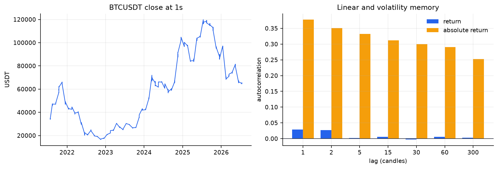
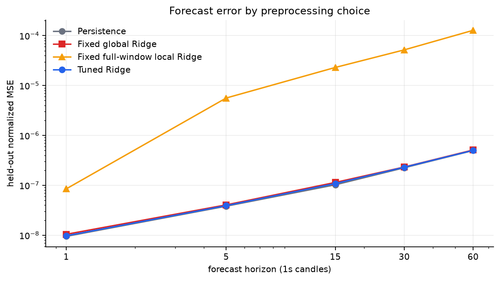
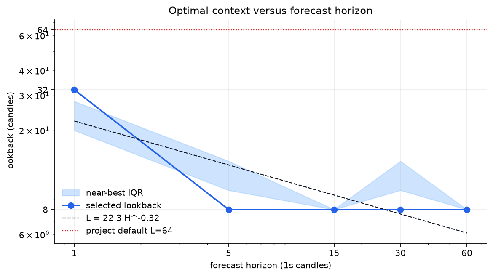
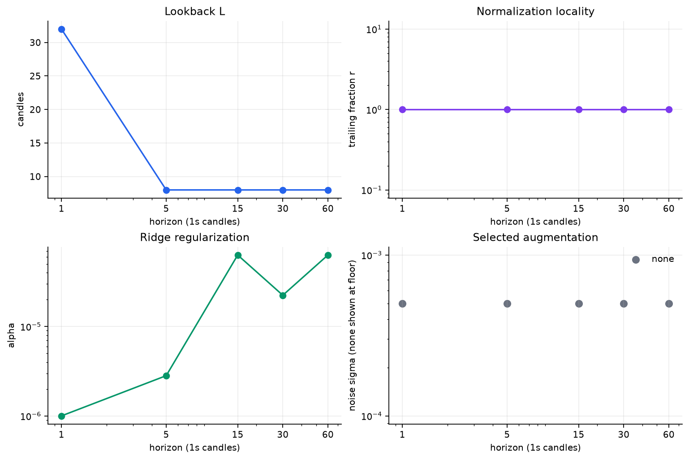
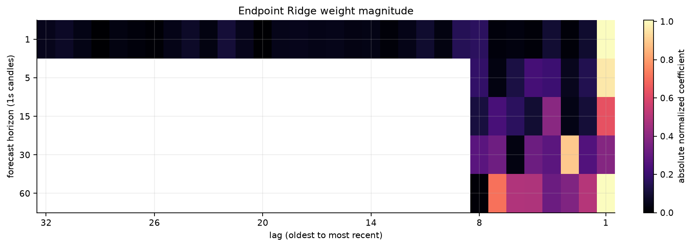
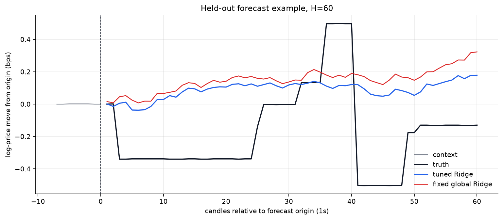

# SearchCast-style BTCUSDT analysis: 1s

> **Result.** At the one-candle horizon, the selected context is **32 1s candles**, using global standard normalization, alpha **1.000e-06**, and none augmentation. Held-out normalized MSE changes by **-2.83%** relative to persistence. Evidence quality at this scale is **sampled**.

## Scope and adaptation

This report applies the transferable analysis from [How Good Can Linear Models Be for Time-Series Forecasting?](https://arxiv.org/html/2606.27282v1) to canonical spot BTCUSDT **log close** at 1s resolution. The model is multi-output Ridge regression. Search covers context length, global versus trailing-window normalization, standard versus robust scaling, time/frequency/no augmentation, and the paper's 21-value alpha grid. Candidate preprocessors are scored with chronological expanding-window validation; the final 20% of time is sealed until evaluation.

BTC close is a single target, so cross-series grouping is not applicable. The paper's forecast-horizon grouping question is represented here by independent tuning at several horizon cutoffs and the fitted relation `L* = a H^b`.

## Dataset statistics

| Statistic | Value |
|---|---:|
| Candles analyzed | 5,270,400 |
| Period | 2021-07-25T00:00:00Z to 2026-07-15T23:59:59Z |
| Source rows read | 5,270,400 / 157,766,400 (3.34%) |
| Price range | $16,527.72 to $119,940.83 |
| Mean / median log return | +0.0008 / +0.0000 bps |
| Return standard deviation | 0.918 bps |
| Mean absolute return | 0.350 bps |
| Annualized volatility | 51.58% |
| Skewness / excess kurtosis | +0.386 / +154.355 |
| Mean high-low range | 0.486 bps |
| Median candle volume | 0.0607 BTC |

Deterministic stratified sample: 61 complete UTC days, one day nearest the 15th of every represented calendar month. Windows never cross the gaps between sampled days.



Return autocorrelation measures linear predictability; absolute-return autocorrelation measures volatility clustering. The latter can be persistent even when signed returns are close to serially uncorrelated.

## Held-out forecasting results

All MSE values are divided by the development-window log-price variance. RMSE and MAE are log-price errors in basis points.

| H (candles) | Test windows | Persistence MSE | Global Ridge MSE | Local-full Ridge MSE | Tuned Ridge MSE | Tuned RMSE | Direction | Gain vs persistence |
|---:|---:|---:|---:|---:|---:|---:|---:|---:|
| 1 | 1800 | 9.48306e-09 | 1.04263e-08 | 8.49413e-08 | 9.75174e-09 | 0.54 bps | 52.0% | -2.83% |
| 5 | 1800 | 3.81725e-08 | 4.05052e-08 | 5.62217e-06 | 3.91621e-08 | 1.08 bps | 52.5% | -2.59% |
| 15 | 1800 | 1.02492e-07 | 1.14304e-07 | 2.30698e-05 | 1.0868e-07 | 1.80 bps | 48.1% | -6.04% |
| 30 | 1800 | 2.24824e-07 | 2.32702e-07 | 5.18708e-05 | 2.30425e-07 | 2.63 bps | 49.1% | -2.49% |
| 60 | 1800 | 4.97992e-07 | 5.10836e-07 | 0.00012787 | 5.02187e-07 | 3.88 bps | 50.0% | -0.84% |



A negative gain means tuned Ridge did not beat the no-change forecast on the sealed test period. Such a result is useful: it bounds how much tradable directional information this linear close-only setup exposes.

## Learned dataset-specific parameters

| H | L | Local/global | Method | r | Effective local points | Alpha | Augmentation | Sigma | CV MSE |
|---:|---:|---|---|---:|---:|---:|---|---:|---:|
| 1 | 32 | global | standard | 1.0000 | n/a | 1.000e-06 | none | 0 | 5.93464e-08 |
| 5 | 8 | global | standard | 1.0000 | n/a | 2.818e-06 | none | 0 | 1.75674e-07 |
| 15 | 8 | global | standard | 1.0000 | n/a | 6.310e-05 | none | 0 | 5.00395e-07 |
| 30 | 8 | global | standard | 1.0000 | n/a | 2.239e-05 | none | 0 | 9.55704e-07 |
| 60 | 8 | global | standard | 1.0000 | n/a | 6.310e-05 | none | 0 | 1.98965e-06 |

The fitted relation is **L* = 22.30 H^-0.317** with R-squared **0.674**. A positive exponent means longer forecast horizons selected more context; a negative exponent means old history became less useful as the target moved farther out.





## What the model uses



The heatmap shows endpoint-forecast coefficients after preprocessing. Bright recent lags indicate local momentum/mean-reversion structure; isolated older bands suggest recurring phase anchors. White/blank left regions are outside the selected context.



The forecast plot is one deterministic held-out example at the longest evaluated horizon. It is diagnostic, not a hand-picked claim about average performance; the table above is the aggregate test result.

## Implications for later studies

- Selected lookback shrinks with horizon (`b=-0.317`).
- Local normalization wins 0/5 horizon cells; robust scaling wins 0/5.
- Noise augmentation wins 0/5 horizon cells.
- The one-step selected lookback is 32 candles versus the project's current nominal 64 candles at this scale.
- The selected lookback touches a searched boundary at H=5, 15, 30, 60; those L values are censored optima, not precise interior estimates.

The selected parameters should be treated as search priors, not fixed production truth. A later model should center its context and normalization search near these values, while retaining neighboring candidates and walk-forward validation.

## Limitations

- The target is univariate log close; the paper's cross-series grouping sweep is not applicable.
- Search uses deterministic joint trials rather than Optuna TPE; the searched axes and 21-value alpha loop match the paper.
- No nonlinear baseline is trained; the comparison isolates preprocessing gains against persistence and fixed Ridge baselines.
- The 1s fit uses one complete UTC day per month; it spans every month but is not an exhaustive 157.8M-row fit.

Fees, leverage, slippage, and position transitions are intentionally absent. Forecast accuracy is not trading profitability, especially at 1s and 1m where errors can be smaller than execution costs.

## Reproduce

```powershell
npm run analysis:searchcast-btc -- --scales 1s
```

Machine-readable details, all CV folds, and top trials are in [`results/1s.json`](results/1s.json).
