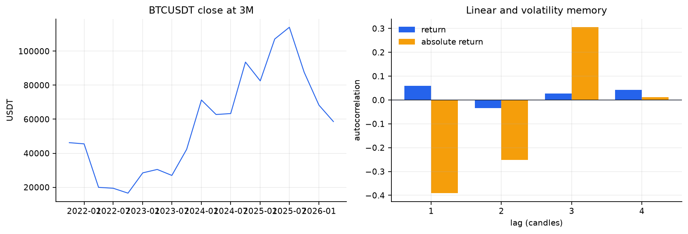
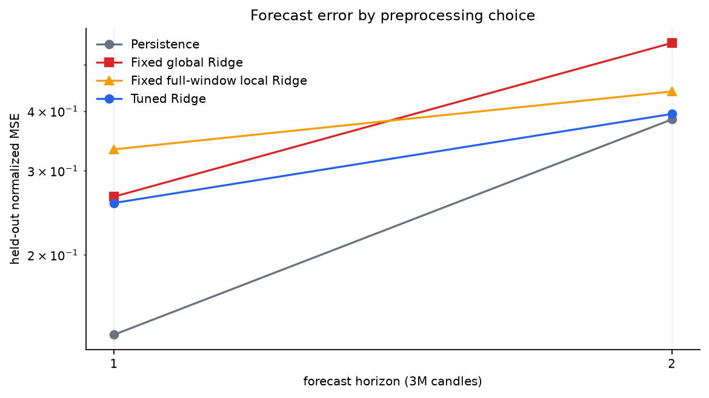
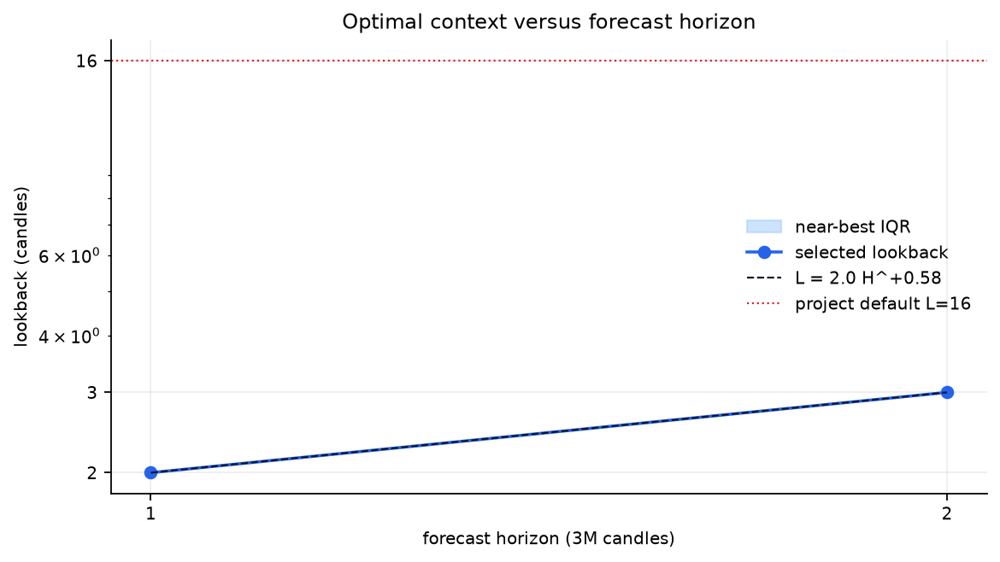
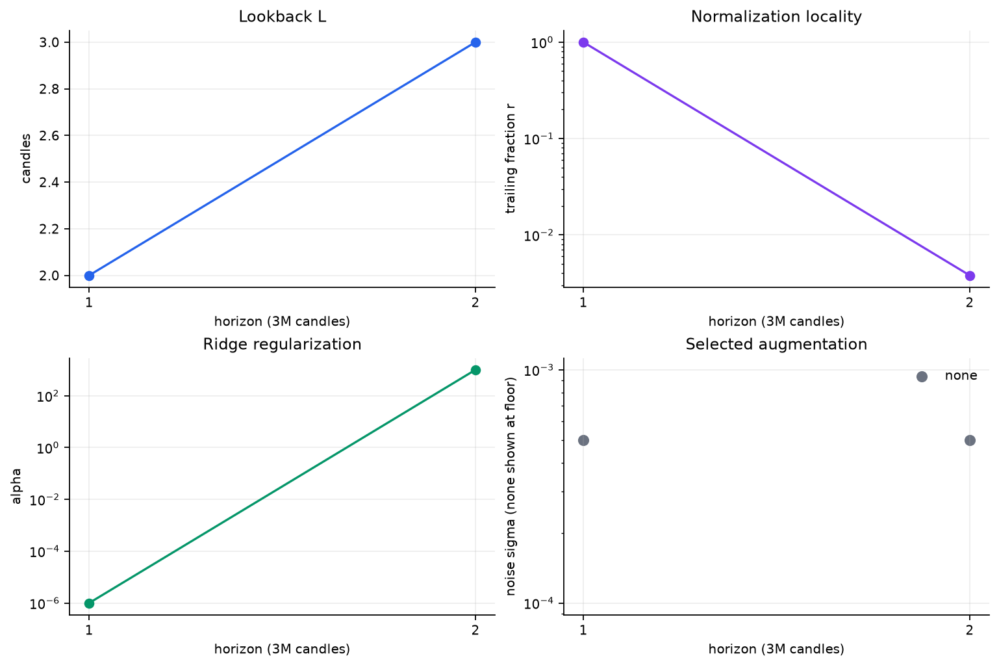
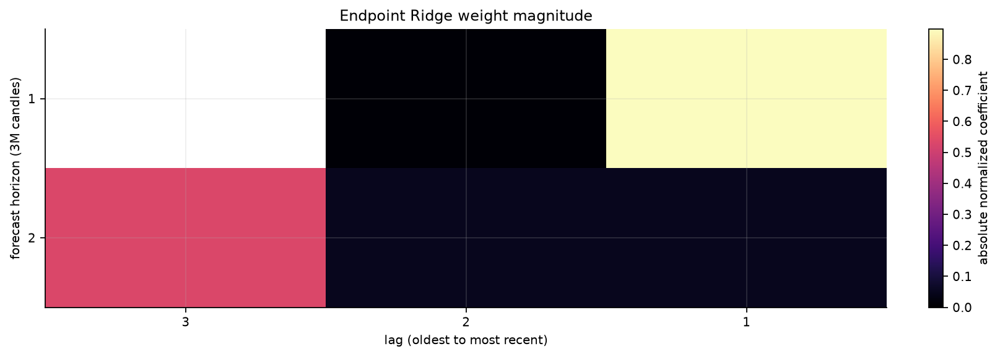
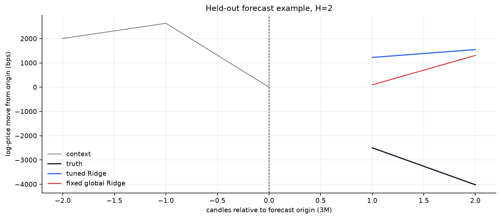

# SearchCast-style BTCUSDT analysis: 3M

> **Result.** At the one-candle horizon, the selected context is **2 3M candles**, using global standard normalization, alpha **1.000e-06**, and none augmentation. Held-out normalized MSE changes by **-88.72%** relative to persistence. Evidence quality at this scale is **exploratory**.

## Scope and adaptation

This report applies the transferable analysis from [How Good Can Linear Models Be for Time-Series Forecasting?](https://arxiv.org/html/2606.27282v1) to canonical spot BTCUSDT **log close** at 3M resolution. The model is multi-output Ridge regression. Search covers context length, global versus trailing-window normalization, standard versus robust scaling, time/frequency/no augmentation, and the paper's 21-value alpha grid. Candidate preprocessors are scored with chronological expanding-window validation; the final 20% of time is sealed until evaluation.

BTC close is a single target, so cross-series grouping is not applicable. The paper's forecast-horizon grouping question is represented here by independent tuning at several horizon cutoffs and the fitted relation `L* = a H^b`.

## Dataset statistics

| Statistic | Value |
|---|---:|
| Candles analyzed | 19 |
| Period | 2021-10-01T00:00:00Z to 2026-04-01T00:00:00Z |
| Source rows read | 2,629,440 / 2,629,440 (100.00%) |
| Price range | $15,476.00 to $126,199.63 |
| Mean / median log return | +132.1167 / -209.0368 bps |
| Return standard deviation | 3253.156 bps |
| Mean absolute return | 2429.590 bps |
| Annualized volatility | 65.06% |
| Skewness / excess kurtosis | -0.344 / +0.539 |
| Mean high-low range | 4313.012 bps |
| Median candle volume | 3,119,020.1714 BTC |

Complete UTC calendar quarters derived from complete monthly candles.



Return autocorrelation measures linear predictability; absolute-return autocorrelation measures volatility clustering. The latter can be persistent even when signed returns are close to serially uncorrelated.

## Held-out forecasting results

All MSE values are divided by the development-window log-price variance. RMSE and MAE are log-price errors in basis points.

| H (candles) | Test windows | Persistence MSE | Global Ridge MSE | Local-full Ridge MSE | Tuned Ridge MSE | Tuned RMSE | Direction | Gain vs persistence |
|---:|---:|---:|---:|---:|---:|---:|---:|---:|
| 1 | 4 | 0.136102 | 0.264813 | 0.332691 | 0.256856 | 2737.30 bps | 25.0% | -88.72% |
| 2 | 3 | 0.384271 | 0.555646 | 0.439771 | 0.394593 | 3206.47 bps | 66.7% | -2.69% |



A negative gain means tuned Ridge did not beat the no-change forecast on the sealed test period. Such a result is useful: it bounds how much tradable directional information this linear close-only setup exposes.

## Learned dataset-specific parameters

| H | L | Local/global | Method | r | Effective local points | Alpha | Augmentation | Sigma | CV MSE |
|---:|---:|---|---|---:|---:|---:|---|---:|---:|
| 1 | 2 | global | standard | 1.0000 | n/a | 1.000e-06 | none | 0 | 0.997965 |
| 2 | 3 | local | robust | 0.0038 | 2 | 1000 | none | 0 | 1.68397 |

The fitted relation is **L* = 2.00 H^+0.585** with R-squared **1.000**. A positive exponent means longer forecast horizons selected more context; a negative exponent means old history became less useful as the target moved farther out.





## What the model uses



The heatmap shows endpoint-forecast coefficients after preprocessing. Bright recent lags indicate local momentum/mean-reversion structure; isolated older bands suggest recurring phase anchors. White/blank left regions are outside the selected context.



The forecast plot is one deterministic held-out example at the longest evaluated horizon. It is diagnostic, not a hand-picked claim about average performance; the table above is the aggregate test result.

## Implications for later studies

- Selected lookback grows with horizon (`b=+0.585`).
- Local normalization wins 1/2 horizon cells; robust scaling wins 1/2.
- Noise augmentation wins 0/2 horizon cells.
- The one-step selected lookback is 2 candles versus the project's current nominal 16 candles at this scale.
- The selected lookback touches a searched boundary at H=1, 2; those L values are censored optima, not precise interior estimates.

The selected parameters should be treated as search priors, not fixed production truth. A later model should center its context and normalization search near these values, while retaining neighboring candidates and walk-forward validation.

## Limitations

- The target is univariate log close; the paper's cross-series grouping sweep is not applicable.
- Search uses deterministic joint trials rather than Optuna TPE; the searched axes and 21-value alpha loop match the paper.
- No nonlinear baseline is trained; the comparison isolates preprocessing gains against persistence and fixed Ridge baselines.
- Only 19 complete 3M candles exist in the common window; estimates are exploratory and high variance.
- At least one horizon has fewer than 30 held-out windows, so test metrics are descriptive rather than inferential.

Fees, leverage, slippage, and position transitions are intentionally absent. Forecast accuracy is not trading profitability, especially at 1s and 1m where errors can be smaller than execution costs.

## Reproduce

```powershell
npm run analysis:searchcast-btc -- --scales 3M
```

Machine-readable details, all CV folds, and top trials are in [`results/3month.json`](results/3month.json).
