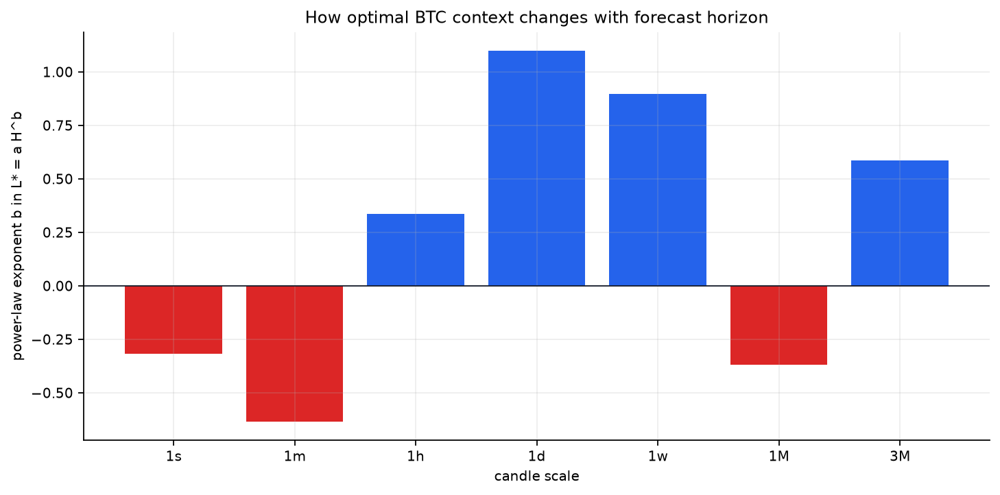

# SearchCast-style BTCUSDT study across seven candle scales

This directory reproduces the transferable parts of [How Good Can Linear Models Be for Time-Series Forecasting?](https://arxiv.org/html/2606.27282v1) on this repository's canonical BTCUSDT data. It contains one document per requested scale, checked-in charts, and JSON with every selected parameter and held-out metric.

## Cross-scale result

| Scale | Candles | One-step L | Project L | Normalization | Alpha | One-step test MSE | Gain vs persistence | L/H exponent b | Evidence |
|---|---:|---:|---:|---|---:|---:|---:|---:|---|
| [1s](1s.md) | 5,270,400 | 32 | 64 | global standard | 1.000e-06 | 9.75174e-09 | -2.83% | -0.317 | sampled |
| [1m](1min.md) | 2,629,440 | 128 | 64 | local standard | 1.000e-06 | 1.23829e-06 | -4.35% | -0.633 | usable |
| [1h](1h.md) | 43,824 | 6 | 32 | global standard | 0.089125 | 7.36553e-05 | -3.08% | +0.336 | usable |
| [1d](1d.md) | 1,826 | 3 | 32 | global standard | 0.089125 | 0.00197986 | -1.73% | +1.099 | usable |
| [1w](1w.md) | 260 | 4 | n/a | local standard | 1.000e-06 | 0.015105 | -34.12% | +0.896 | usable |
| [1M](1month.md) | 59 | 12 | 16 | local standard | 0.70795 | 0.0615238 | -17.25% | -0.368 | exploratory |
| [3M](3month.md) | 19 | 2 | 16 | global standard | 1.000e-06 | 0.256856 | -88.72% | +0.585 | exploratory |

## Main findings

- Tuned Ridge beats persistence in **0/32** sealed-test horizon cells. The no-change forecast is the stronger close-only baseline across this corpus.
- On 1s through 1w, endpoint direction accuracy spans **22.5% to 52.5%**; no stable directional edge appears.
- Local normalization is selected in **13/32** cells and noise augmentation in **1/32**. BTC log close usually prefers the simpler global/no-noise path, unlike the paper's benchmark aggregate.
- Minute and second contexts contract sharply beyond the one-step target, while the one-day target can hit very long contexts. Boundary hits are hypotheses for a wider search, not proof that maximum history is intrinsically best.
- Monthly and quarterly estimates are too data-limited to set production parameters; they mainly show that the nominal 16-candle contexts cannot be validated from five years of local history.



The exponent is a compact stationarity diagnostic. Positive values mean longer targets benefit from more history; negative values mean distant history increasingly hurts. Monthly and quarterly exponents should not drive architecture decisions without a longer historical corpus.

## Documents

- [1s report](1s.md)
- [1m report](1min.md)
- [1h report](1h.md)
- [1d report](1d.md)
- [1w report](1w.md)
- [1M report](1month.md)
- [3M report](3month.md)

## Method contract

- Source: immutable canonical spot BTCUSDT candle references.
- Common interval: 2021-07-25 through 2026-07-24 UTC.
- Target: future log close path.
- Outer split: first 80% development, final 20% held out.
- Inner selection: three chronological expanding folds when sample count allows.
- Ridge alpha: 21 log-spaced values from `1e-6` through `1e3`.
- Preprocessing trials per horizon: 20.
- 1s fit sampling: one complete day nearest the 15th of every calendar month; no windows cross sampled-day gaps.
- 1w: complete Monday-Sunday UTC calendar weeks only.
- 1M/3M: complete UTC calendar months/quarters only.

## Reproduce everything

```powershell
npm run analysis:searchcast-btc
```

The consolidated machine-readable artifact is [`results/all-scales.json`](results/all-scales.json).
